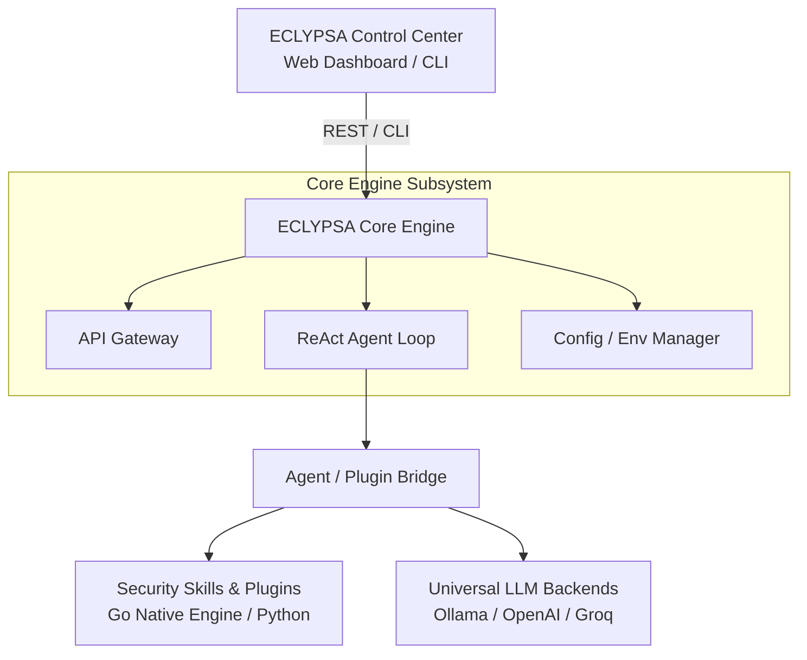

<div align="center">

# 🛡️ ECLYPSA AI

**Autonomous, Privacy-First & High-Performance AI Platform for Security & Automation**

[](https://github.com/eclypsa-ai/eclypsa-ai/releases) [](https://www.python.org/) [](https://golang.org/) [](https://www.docker.com/) [](LICENSE)

[Architecture](#-system-architecture) • [Quick Start](#-quick-start) • [Docker Deployment](#-docker-deployment) • [Plugin Development](#-developing-plugins) • [Contributing](#-contributing)

</div>

---

## 👁️ Overview

**ECLYPSA AI** is a modular, privacy-focused open-source AI platform engineered for security automation, high-speed reconnaissance, and autonomous task execution. By coupling a pythonic **ReAct (Reasoning + Acting) Agent Loop** with a **high-performance Go execution engine**, ECLYPSA AI bridges the gap between local/cloud LLM intelligence and low-latency system-level operations.

Designed to operate seamlessly on-premises with local models (**Ollama / Llama 3**) or via cloud providers (**OpenAI / Groq**), ECLYPSA AI ensures complete data privacy for security research and offensive automation pipelines.

---

## ✨ Key Features

- 🧠 **Autonomous ReAct Engine:** Built-in reasoning loop allowing agents to evaluate tasks, plan multi-step actions, execute tools, and reflect on observations.
- ⚡ **Go-Powered High-Speed Subsystem:** Multithreaded TCP port scanner and network banner grabber compiled natively in Go for near-zero latency.
- 🔌 **Dynamic Plugin Architecture:** Hot-swappable, isolated plugin loader allowing easy extension with custom security skills and tools.
- 🔒 **Privacy-First & Local LLM Native:** First-class support for offline local execution via Ollama (`llama3`, `mistral`, etc.) without telemetry leaking.
- 🌐 **Embedded Control Center & REST API:** Native HTTP/REST API gateway and lightweight web dashboard for real-time task monitoring and telemetry.
- 🐳 **Multi-Stage Containerized Architecture:** Docker Compose setup provisioning both the core platform and an isolated local LLM environment out of the box.

---

## 🏗️ System Architecture



## 📁 Repository Structure

```text

eclypsa-ai/
├── agent/                  # Agent Framework (ReAct Engine, LLM Providers, Bridge)
│   ├── bridge.py           # Maps dynamic plugins to executable agent tools
│   ├── context.py          # Execution session context & step memory
│   ├── executor.py         # Base task executor
│   ├── llm.py              # Universal LLM Provider Interface (Ollama / OpenAI)
│   └── react.py            # ReAct (Reasoning & Acting) decision loop
├── api/                    # REST API & Web Dashboard Subsystem
│   └── server.py           # Native HTTP Server with Embedded Control Center
├── cli/                    # Command-Line Tooling
│   └── main.py             # CLI Entrypoint for agent execution & management
├── core/                   # Core Engine Subsystem
│   ├── config.py           # Configuration parser & env loader
│   └── engine.py           # System lifecycle, logging & health management
├── engine/                 # Native High-Performance Go Modules
│   └── recon.go            # Multithreaded TCP port scanner
├── plugins/                # Modular Skill System
│   ├── base.py             # Base abstract plugin interface
│   ├── loader.py           # Dynamic plugin discovery & loader
│   └── recon.py            # Network reconnaissance plugin
├── tests/                  # Unit Test Suite
│   ├── test_config.py      # Configuration tests
│   └── test_engine.py      # Core engine tests
├── scripts/                # Utility & Automation Scripts
│   └── setup.sh            # Automated project setup script
├── Dockerfile              # Multi-stage production container build
├── docker-compose.yml      # Orchestration for Core Engine & Ollama LLM
├── Makefile                # Build, test, and automation task runner
└── requirements.txt        # Python dependency manifest

```
## 🚀 Quick Start
### Prerequisites
 * **Python 3.11+**
 * **Go 1.22+** (Optional, for building native engines locally)
 * **Ollama** (Recommended for local model inference)
### Local Installation
 1. **Clone the repository:**
   ```bash
   git clone [https://github.com/eclypsa-ai/eclypsa-ai.git](https://github.com/eclypsa-ai/eclypsa-ai.git)
   cd eclypsa-ai
   
   ```
 2. **Run automated setup:**
   ```bash
   chmod +x scripts/setup.sh
   ./scripts/setup.sh
   
   ```
 3. **Compile the Go engine module:**
   ```bash
   make build-go
   
   ```
 4. **Verify environment via test suite:**
   ```bash
   make test
   
   ```
## 💻 Usage & CLI Interface
### Running Autonomous Security Tasks
Execute tasks using the local **Ollama** provider:
```bash
python -m cli.main agent --task "Perform a network port recon scan on target 127.0.0.1 and summarize open ports." --provider ollama --model llama3

```
Execute tasks using **OpenAI**:
```bash
python -m cli.main agent --task "Analyze target 192.168.1.1 for open services." --provider openai --api-key YOUR_API_KEY --model gpt-4o

```
### Launching API & Web Dashboard
Start the integrated REST API Gateway and Dashboard Control Center:
```bash
python -m api.server

```
Navigate to http://localhost:8080 in your browser to access the **ECLYPSA Operational Dashboard**.
## 🐳 Docker Deployment
The fastest way to deploy ECLYPSA AI along with a fully local Ollama LLM container is using docker-compose:
```bash
# Build and spin up containers
docker-compose up --build -d

# Check running services
docker ps

```
Access the dashboard at http://localhost:8080.
## 🔌 Developing Plugins
Adding custom tools to ECLYPSA AI is straightforward. Create a new .py file in the plugins/ directory extending BasePlugin:
```python
from plugins.base import BasePlugin
from typing import Dict, Any, Optional

class CustomScannerPlugin(BasePlugin):
    def __init__(self):
        super().__init__(name="custom_scanner", version="1.0.0")

    def initialize(self, config: Optional[Dict[str, Any]] = None) -> bool:
        self.is_enabled = True
        return True

    def execute(self, payload: Dict[str, Any]) -> Dict[str, Any]:
        target = payload.get("target", "localhost")
        # Custom scanning logic here...
        return {"status": "success", "result": f"Scanned {target}"}

    def shutdown(self) -> None:
        pass

```
The AgentPluginBridge will automatically discover and register your plugin as an executable tool for the ReAct Agent on startup!
## 🧪 Testing
Run the full unit test suite using unittest or the included Makefile:
```bash
# Using Makefile
make test

# Direct Python invocation
python -m unittest discover -s tests -p "test_*.py"

```
## 🤝 Contributing
Contributions are welcome! Please follow these steps:
 1. Fork the repository.
 2. Create your feature branch (git checkout -b feature/AmazingFeature).
 3. Commit your changes (git commit -m 'Add some AmazingFeature').
 4. Push to the branch (git push origin feature/AmazingFeature).
 5. Open a Pull Request.
Please refer to CODE_OF_CONDUCT.md and CONTRIBUTING.md for detailed guidelines.
## 📄 License
Distributed under the **MIT License**. See LICENSE for more information.
<div align="center">
<sub>Built with precision for security researchers, penetration testers, and AI engineers.</sub>
</div>
```

```
